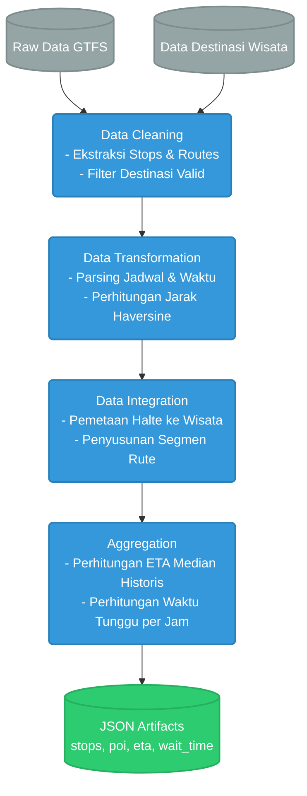

# Gambar 4.5 Flowchart Data Preparation

```mermaid
flowchart TD
    classDef input fill:#95a5a6,stroke:#7f8c8d,stroke-width:2px,color:#fff;
    classDef process fill:#3498db,stroke:#2980b9,stroke-width:2px,color:#fff,rx:5px,ry:5px;
    classDef db fill:#2ecc71,stroke:#27ae60,stroke-width:2px,color:#fff,rx:10px,ry:10px;

    A[(Raw Data GTFS)]:::input
    B[(Data Destinasi Wisata)]:::input
    
    C(Data Cleaning\n- Ekstraksi Stops & Routes\n- Filter Destinasi Valid):::process
    D(Data Transformation\n- Parsing Jadwal & Waktu\n- Perhitungan Jarak Haversine):::process
    
    E(Data Integration\n- Pemetaan Halte ke Wisata\n- Penyusunan Segmen Rute):::process
    F(Aggregation\n- Perhitungan ETA Median Historis\n- Perhitungan Waktu Tunggu per Jam):::process
    
    G[(JSON Artifacts\nstops, poi, eta, wait_time)]:::db

    A --> C
    B --> C
    C --> D
    D --> E
    E --> F
    F --> G
```
