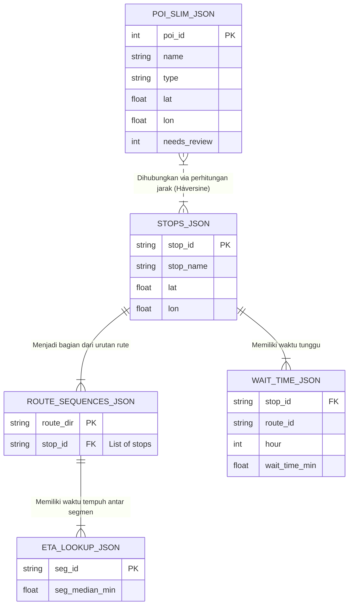

# Gambar 4.6 Diagram Integrasi Dataset (JSON Artifacts)

```mermaid
erDiagram
    POI_SLIM_JSON {
        int poi_id PK
        string name
        string type
        float lat
        float lon
        int needs_review
    }

    STOPS_JSON {
        string stop_id PK
        string stop_name
        float lat
        float lon
    }

    ROUTE_SEQUENCES_JSON {
        string route_dir PK
        string stop_id FK "List of stops"
    }
    
    ETA_LOOKUP_JSON {
        string seg_id PK
        float seg_median_min
    }
    
    WAIT_TIME_JSON {
        string stop_id FK
        string route_id
        int hour
        float wait_time_min
    }

    POI_SLIM_JSON }|..|{ STOPS_JSON : "Dihubungkan via perhitungan jarak (Haversine)"
    STOPS_JSON ||--|{ ROUTE_SEQUENCES_JSON : "Menjadi bagian dari urutan rute"
    STOPS_JSON ||--|{ WAIT_TIME_JSON : "Memiliki waktu tunggu"
    ROUTE_SEQUENCES_JSON ||--|{ ETA_LOOKUP_JSON : "Memiliki waktu tempuh antar segmen"
```
