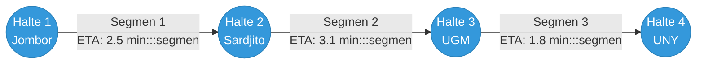

# Gambar 4.17 Diagram Segment-Based ETA

```mermaid
flowchart LR
    classDef halte fill:#3498db,stroke:#2980b9,color:#fff,rx:20px,ry:20px;
    classDef segmen fill:#f1c40f,stroke:#f39c12,color:#333;

    A((Halte 1\nJombor)):::halte -- "Segmen 1\nETA: 2.5 min":::segmen --> B((Halte 2\nSardjito)):::halte
    B -- "Segmen 2\nETA: 3.1 min":::segmen --> C((Halte 3\nUGM)):::halte
    C -- "Segmen 3\nETA: 1.8 min":::segmen --> D((Halte 4\nUNY)):::halte
```
