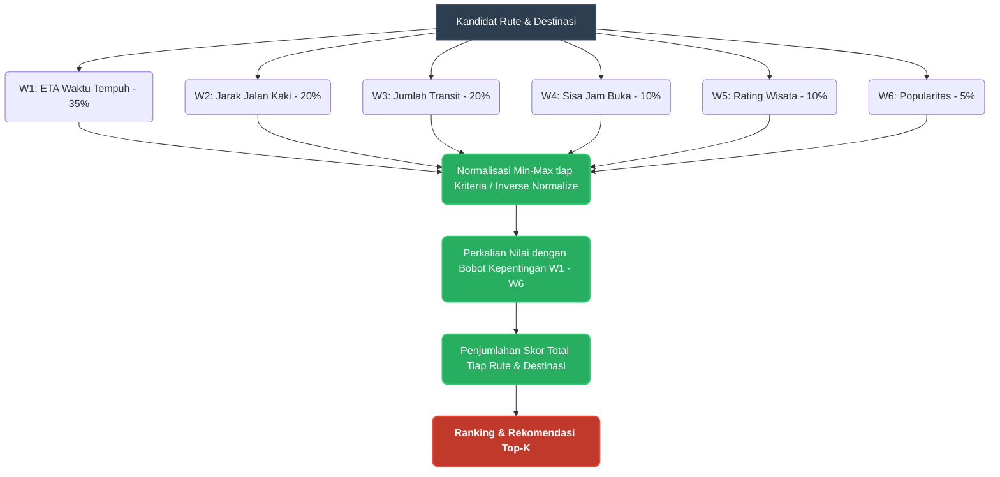

# Gambar 4.8 Diagram Model Weighted Ranking

```mermaid
flowchart TD
    classDef input fill:#2c3e50,stroke:#34495e,stroke-width:2px,color:#fff;
    classDef process fill:#27ae60,stroke:#2ecc71,stroke-width:2px,color:#fff,rx:8px,ry:8px;
    classDef output fill:#c0392b,stroke:#e74c3c,stroke-width:2px,color:#fff,font-weight:bold,rx:8px,ry:8px;

    A[Kandidat Rute & Destinasi]:::input
    
    B1(W1: ETA Waktu Tempuh - 35%)
    B2(W2: Jarak Jalan Kaki - 20%)
    B3(W3: Jumlah Transit - 20%)
    B4(W4: Sisa Jam Buka - 10%)
    B5(W5: Rating Wisata - 10%)
    B6(W6: Popularitas - 5%)
    
    C(Normalisasi Min-Max tiap Kriteria / Inverse Normalize):::process
    D(Perkalian Nilai dengan Bobot Kepentingan W1 - W6):::process
    E(Penjumlahan Skor Total Tiap Rute & Destinasi):::process
    
    F[Ranking & Rekomendasi Top-K]:::output

    A --> B1
    A --> B2
    A --> B3
    A --> B4
    A --> B5
    A --> B6
    
    B1 --> C
    B2 --> C
    B3 --> C
    B4 --> C
    B5 --> C
    B6 --> C
    
    C --> D
    D --> E
    E --> F
```
