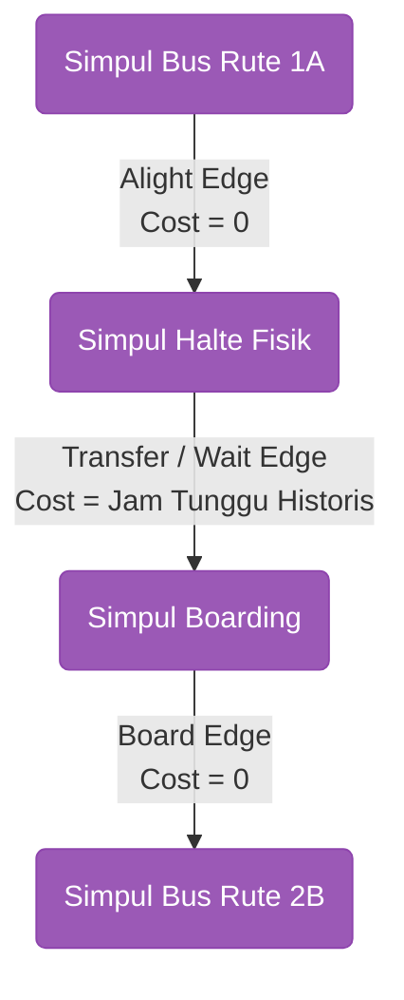

# Gambar 4.23 Diagram Mekanisme Transit

```mermaid
flowchart TD
    classDef node fill:#9b59b6,stroke:#8e44ad,color:#fff,rx:5px,ry:5px;
    classDef edge fill:#ecf0f1,stroke:#bdc3c7,color:#333;

    A(Simpul Bus Rute 1A):::node -->|Alight Edge\nCost = 0| B(Simpul Halte Fisik):::node
    B -->|Transfer / Wait Edge\nCost = Jam Tunggu Historis| C(Simpul Boarding):::node
    C -->|Board Edge\nCost = 0| D(Simpul Bus Rute 2B):::node
```
