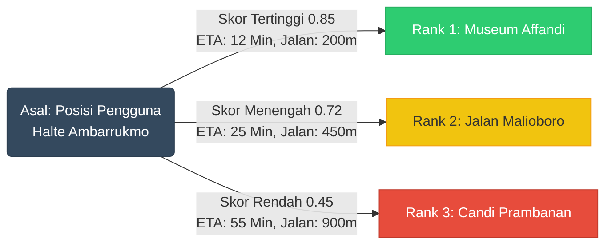

# Gambar 4.29 Contoh Hasil Rekomendasi Perjalanan

```mermaid
flowchart LR
    classDef origin fill:#34495e,stroke:#2c3e50,color:#fff;
    classDef rank1 fill:#2ecc71,stroke:#27ae60,color:#fff;
    classDef rank2 fill:#f1c40f,stroke:#f39c12,color:#333;
    classDef rank3 fill:#e74c3c,stroke:#c0392b,color:#fff;

    A(Asal: Posisi Pengguna\nHalte Ambarrukmo):::origin
    
    A -->|Skor Tertinggi 0.85\nETA: 12 Min, Jalan: 200m| B[Rank 1: Museum Affandi]:::rank1
    A -->|Skor Menengah 0.72\nETA: 25 Min, Jalan: 450m| C[Rank 2: Jalan Malioboro]:::rank2
    A -->|Skor Rendah 0.45\nETA: 55 Min, Jalan: 900m| D[Rank 3: Candi Prambanan]:::rank3
```
