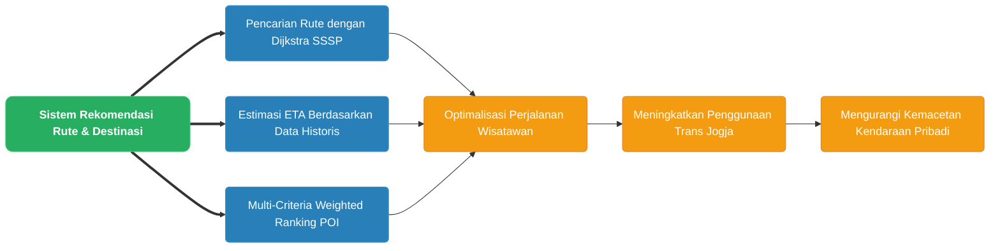

# Gambar 4.2 Diagram Tujuan Pengembangan Sistem

```mermaid
flowchart LR
    classDef goal fill:#27ae60,stroke:#2ecc71,color:#fff,font-weight:bold,rx:10px,ry:10px;
    classDef feature fill:#2980b9,stroke:#3498db,color:#fff,rx:5px,ry:5px;
    classDef benefit fill:#f39c12,stroke:#e67e22,color:#fff,rx:5px,ry:5px;

    A[Sistem Rekomendasi Rute & Destinasi]:::goal
    
    B(Pencarian Rute dengan Dijkstra SSSP):::feature
    C(Estimasi ETA Berdasarkan Data Historis):::feature
    D(Multi-Criteria Weighted Ranking POI):::feature
    
    E(Optimalisasi Perjalanan Wisatawan):::benefit
    F(Meningkatkan Penggunaan Trans Jogja):::benefit
    G(Mengurangi Kemacetan Kendaraan Pribadi):::benefit

    A ==> B
    A ==> C
    A ==> D
    
    B --> E
    C --> E
    D --> E
    
    E --> F
    F --> G
```
