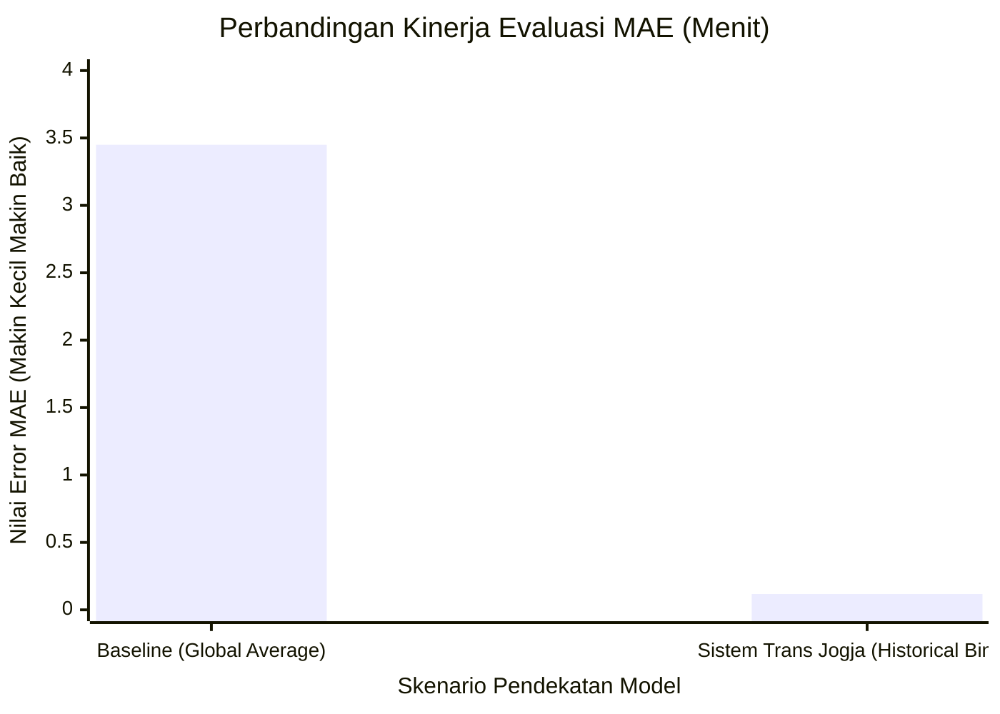

# Gambar 4.30 Diagram Perbandingan Hasil Evaluasi

```mermaid
xychart-beta
    title "Perbandingan Kinerja Evaluasi MAE (Menit)"
    x-axis "Skenario Pendekatan Model" ["Baseline (Global Average)", "Sistem Trans Jogja (Historical Binning)"]
    y-axis "Nilai Error MAE (Makin Kecil Makin Baik)" 0 --> 4
    bar [3.45, 0.117]
```
