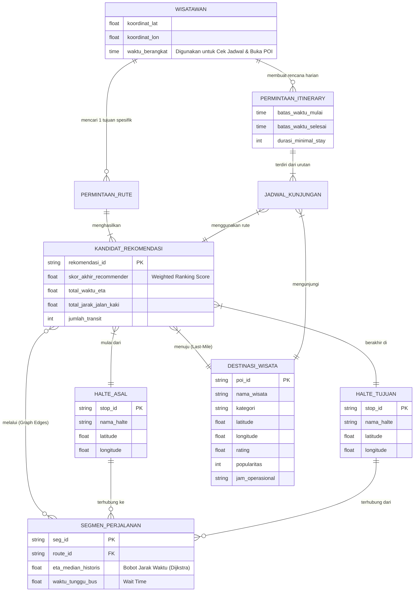

# Gambar 4.16 Entity Relationship Diagram (ERD) Keseluruhan Sistem Rekomendasi

```mermaid
erDiagram
    WISATAWAN ||--o{ PERMINTAAN_RUTE : "mencari 1 tujuan spesifik"
    WISATAWAN ||--o{ PERMINTAAN_ITINERARY : "membuat rencana harian"
    
    PERMINTAAN_RUTE ||--|{ KANDIDAT_REKOMENDASI : "menghasilkan"
    PERMINTAAN_ITINERARY ||--|{ JADWAL_KUNJUNGAN : "terdiri dari urutan"
    
    KANDIDAT_REKOMENDASI }|--|| HALTE_ASAL : "mulai dari"
    KANDIDAT_REKOMENDASI }|--|| HALTE_TUJUAN : "berakhir di"
    KANDIDAT_REKOMENDASI }o--o{ SEGMEN_PERJALANAN : "melalui (Graph Edges)"
    KANDIDAT_REKOMENDASI }|--|| DESTINASI_WISATA : "menuju (Last-Mile)"
    
    JADWAL_KUNJUNGAN }|--|| DESTINASI_WISATA : "mengunjungi"
    JADWAL_KUNJUNGAN }|--|| KANDIDAT_REKOMENDASI : "menggunakan rute"
    
    HALTE_ASAL ||--o{ SEGMEN_PERJALANAN : "terhubung ke"
    HALTE_TUJUAN ||--o{ SEGMEN_PERJALANAN : "terhubung dari"
    
    DESTINASI_WISATA {
        string poi_id PK
        string nama_wisata
        string kategori
        float latitude
        float longitude
        float rating
        int popularitas
        string jam_operasional
    }
    
    HALTE_ASAL {
        string stop_id PK
        string nama_halte
        float latitude
        float longitude
    }
    
    HALTE_TUJUAN {
        string stop_id PK
        string nama_halte
        float latitude
        float longitude
    }
    
    SEGMEN_PERJALANAN {
        string seg_id PK
        string route_id FK
        float eta_median_historis "Bobot Jarak Waktu (Dijkstra)"
        float waktu_tunggu_bus "Wait Time"
    }
    
    KANDIDAT_REKOMENDASI {
        string rekomendasi_id PK
        float skor_akhir_recommender "Weighted Ranking Score"
        float total_waktu_eta
        float total_jarak_jalan_kaki
        int jumlah_transit
    }
    
    WISATAWAN {
        float koordinat_lat
        float koordinat_lon
        time waktu_berangkat "Digunakan untuk Cek Jadwal & Buka POI"
    }
    
    PERMINTAAN_ITINERARY {
        time batas_waktu_mulai
        time batas_waktu_selesai
        int durasi_minimal_stay
    }
```
