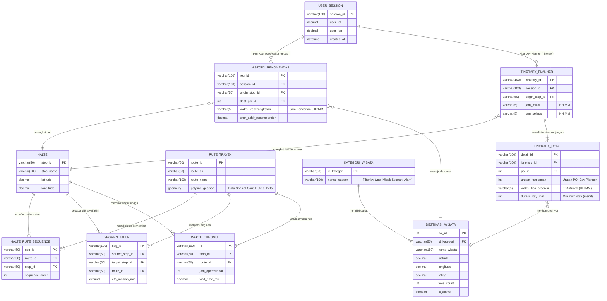

# Gambar 4.17 Skema Relasi Database Sistem (Physical Data Model Lengkap)

```mermaid
erDiagram
    %% ==========================================
    %% STATIC DATA (MASTER DATA TRANSAKSI)
    %% ==========================================
    HALTE {
        varchar(50) stop_id PK
        varchar(100) stop_name
        decimal latitude
        decimal longitude
    }
    
    RUTE_TRAYEK {
        varchar(50) route_id PK
        varchar(50) route_dir
        varchar(100) route_name
        geometry polyline_geojson "Data Spasial Garis Rute di Peta"
    }
    
    HALTE_RUTE_SEQUENCE {
        varchar(50) seq_id PK
        varchar(50) route_id FK
        varchar(50) stop_id FK
        int sequence_order
    }
    
    SEGMEN_JALUR {
        varchar(100) seg_id PK
        varchar(50) source_stop_id FK
        varchar(50) target_stop_id FK
        varchar(50) route_id FK
        decimal eta_median_min
    }
    
    WAKTU_TUNGGU {
        varchar(100) id PK
        varchar(50) stop_id FK
        varchar(50) route_id FK
        int jam_operasional
        decimal wait_time_min
    }
    
    KATEGORI_WISATA {
        varchar(50) id_kategori PK
        varchar(100) nama_kategori "Filter by type (Misal: Sejarah, Alam)"
    }
    
    DESTINASI_WISATA {
        int poi_id PK
        varchar(50) id_kategori FK
        varchar(150) nama_wisata
        decimal latitude
        decimal longitude
        decimal rating
        int vote_count
        boolean is_active
    }

    %% ==========================================
    %% TRANSACTIONAL DATA (FITUR SISTEM)
    %% ==========================================
    USER_SESSION {
        varchar(100) session_id PK
        decimal user_lat
        decimal user_lon
        datetime created_at
    }

    HISTORY_REKOMENDASI {
        varchar(100) req_id PK
        varchar(100) session_id FK
        varchar(50) origin_stop_id FK
        int dest_poi_id FK
        varchar(5) waktu_keberangkatan "Jam Pencarian (HH:MM)"
        decimal skor_akhir_recommender
    }
    
    ITINERARY_PLANNER {
        varchar(100) itinerary_id PK
        varchar(100) session_id FK
        varchar(50) origin_stop_id FK
        varchar(5) jam_mulai "HH:MM"
        varchar(5) jam_selesai "HH:MM"
    }
    
    ITINERARY_DETAIL {
        varchar(100) detail_id PK
        varchar(100) itinerary_id FK
        int poi_id FK
        int urutan_kunjungan "Urutan POI Day-Planner"
        varchar(5) waktu_tiba_prediksi "ETA Arrival (HH:MM)"
        int durasi_stay_min "Minimum stay (menit)"
    }

    %% Definisi Relasi Master Data
    RUTE_TRAYEK ||--|{ HALTE_RUTE_SEQUENCE : "memiliki rute perhentian"
    HALTE ||--|{ HALTE_RUTE_SEQUENCE : "terdaftar pada urutan"
    HALTE ||--|{ SEGMEN_JALUR : "sebagai titik awal/akhir"
    RUTE_TRAYEK ||--|{ SEGMEN_JALUR : "melintasi segmen"
    HALTE ||--|{ WAKTU_TUNGGU : "memiliki waktu tunggu"
    RUTE_TRAYEK ||--|{ WAKTU_TUNGGU : "untuk armada rute"
    KATEGORI_WISATA ||--|{ DESTINASI_WISATA : "memiliki daftar"
    
    %% Definisi Relasi Transaksional (Fitur)
    USER_SESSION ||--o{ HISTORY_REKOMENDASI : "Fitur Cari Rute/Rekomendasi"
    HISTORY_REKOMENDASI }o--|| HALTE : "berangkat dari"
    HISTORY_REKOMENDASI }o--|| DESTINASI_WISATA : "menuju destinasi"
    
    USER_SESSION ||--o{ ITINERARY_PLANNER : "Fitur Day Planner (Itinerary)"
    ITINERARY_PLANNER }o--|| HALTE : "berangkat dari halte awal"
    ITINERARY_PLANNER ||--|{ ITINERARY_DETAIL : "memiliki urutan kunjungan"
    ITINERARY_DETAIL }o--|| DESTINASI_WISATA : "mengunjungi POI"
```
