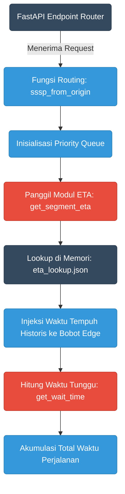

# Gambar 4.34 Diagram Integrasi Algoritma ETA dengan Sistem

```mermaid
flowchart TD
    classDef module fill:#34495e,stroke:#2c3e50,color:#fff,rx:5px,ry:5px;
    classDef action fill:#3498db,stroke:#2980b9,color:#fff,rx:5px,ry:5px;
    classDef core fill:#e74c3c,stroke:#c0392b,color:#fff,rx:5px,ry:5px;

    A(FastAPI Endpoint Router):::module -->|Menerima Request| B(Fungsi Routing: sssp_from_origin):::action
    B --> C(Inisialisasi Priority Queue):::action
    C --> D(Panggil Modul ETA: get_segment_eta):::core
    D --> E(Lookup di Memori: eta_lookup.json):::module
    E --> F(Injeksi Waktu Tempuh Historis ke Bobot Edge):::action
    F --> G(Hitung Waktu Tunggu: get_wait_time):::core
    G --> H(Akumulasi Total Waktu Perjalanan):::action
```
