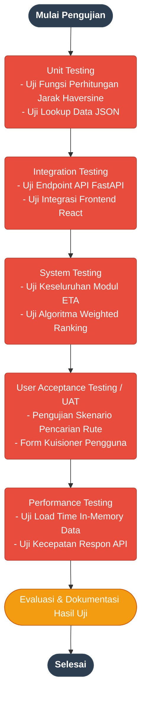

# Gambar 4.14 Diagram Alur Pengujian Sistem

```mermaid
flowchart TD
    classDef phase fill:#2c3e50,stroke:#34495e,color:#fff,font-weight:bold,rx:8px,ry:8px;
    classDef process fill:#e74c3c,stroke:#c0392b,color:#fff,rx:5px,ry:5px;
    classDef doc fill:#f39c12,stroke:#d35400,color:#fff,rx:5px,ry:5px;

    S([Mulai Pengujian]):::phase
    
    A(Unit Testing\n- Uji Fungsi Perhitungan Jarak Haversine\n- Uji Lookup Data JSON):::process
    B(Integration Testing\n- Uji Endpoint API FastAPI\n- Uji Integrasi Frontend React):::process
    
    C(System Testing\n- Uji Keseluruhan Modul ETA\n- Uji Algoritma Weighted Ranking):::process
    
    D(User Acceptance Testing / UAT\n- Pengujian Skenario Pencarian Rute\n- Form Kuisioner Pengguna):::process
    
    E(Performance Testing\n- Uji Load Time In-Memory Data\n- Uji Kecepatan Respon API):::process
    
    F([Evaluasi & Dokumentasi Hasil Uji]):::doc
    G([Selesai]):::phase

    S --> A
    A --> B
    B --> C
    C --> D
    D --> E
    E --> F
    F --> G
```
