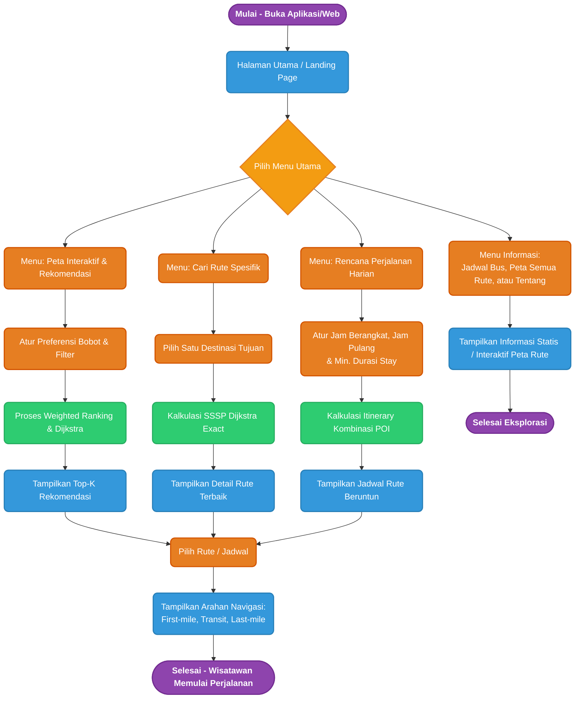

# Gambar 4.15 Diagram Alur Pengguna (User Flow)

```mermaid
flowchart TD
    classDef startEnd fill:#8e44ad,stroke:#732d91,stroke-width:2px,color:#fff,rx:20px,ry:20px,font-weight:bold;
    classDef page fill:#3498db,stroke:#2980b9,stroke-width:2px,color:#fff,rx:8px,ry:8px;
    classDef action fill:#e67e22,stroke:#d35400,stroke-width:2px,color:#fff,rx:8px,ry:8px;
    classDef system fill:#2ecc71,stroke:#27ae60,stroke-width:2px,color:#fff,rx:8px,ry:8px;
    classDef decision fill:#f39c12,stroke:#e67e22,stroke-width:2px,color:#fff,rx:50px,ry:50px;

    A([Mulai - Buka Aplikasi/Web]):::startEnd
    
    B(Halaman Utama / Landing Page):::page
    
    D{Pilih Menu Utama}:::decision
    
    %% Alur 1: Rekomendasi Destinasi (MapPage)
    E1(Menu: Peta Interaktif & Rekomendasi):::action
    F1(Atur Preferensi Bobot & Filter):::action
    G1(Proses Weighted Ranking & Dijkstra):::system
    H1(Tampilkan Top-K Rekomendasi):::page
    
    %% Alur 2: Cari Rute Spesifik (MapPage)
    E2(Menu: Cari Rute Spesifik):::action
    F2(Pilih Satu Destinasi Tujuan):::action
    G2(Kalkulasi SSSP Dijkstra Exact):::system
    H2(Tampilkan Detail Rute Terbaik):::page
    
    %% Alur 3: Day Planner (Itinerary)
    E3(Menu: Rencana Perjalanan Harian):::action
    F3(Atur Jam Berangkat, Jam Pulang\n& Min. Durasi Stay):::action
    G3(Kalkulasi Itinerary Kombinasi POI):::system
    H3(Tampilkan Jadwal Rute Beruntun):::page
    
    %% Alur 4: Informational (Jadwal, Rute, Tentang)
    E4(Menu Informasi:\nJadwal Bus, Peta Semua Rute, atau Tentang):::action
    H4(Tampilkan Informasi Statis / Interaktif Peta Rute):::page
    
    I(Pilih Rute / Jadwal):::action
    J(Tampilkan Arahan Navigasi:\nFirst-mile, Transit, Last-mile):::page
    K([Selesai - Wisatawan Memulai Perjalanan]):::startEnd
    L([Selesai Eksplorasi]):::startEnd

    A --> B
    B --> D
    
    D --> E1
    D --> E2
    D --> E3
    D --> E4
    
    E1 --> F1
    F1 --> G1
    G1 --> H1
    
    E2 --> F2
    F2 --> G2
    G2 --> H2
    
    E3 --> F3
    F3 --> G3
    G3 --> H3
    
    E4 --> H4
    H4 --> L
    
    H1 --> I
    H2 --> I
    H3 --> I
    
    I --> J
    J --> K
```
