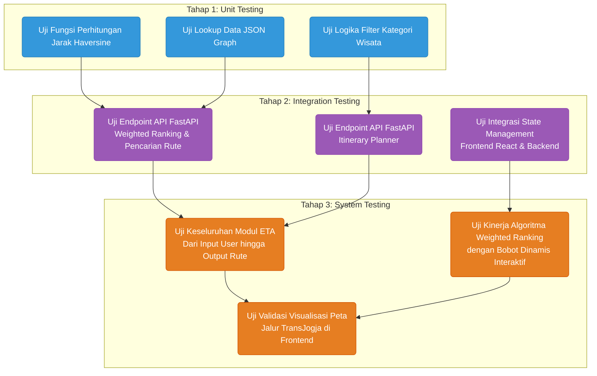

# Gambar 4.38 Diagram Rincian Pengujian Fungsional (Unit, Integrasi, dan Sistem)

```mermaid
flowchart TD
    classDef unit fill:#3498db,stroke:#2980b9,color:#fff,rx:5px,ry:5px;
    classDef integration fill:#9b59b6,stroke:#8e44ad,color:#fff,rx:5px,ry:5px;
    classDef system fill:#e67e22,stroke:#d35400,color:#fff,rx:5px,ry:5px;
    classDef group fill:none,stroke:#2c3e50,stroke-width:2px,stroke-dasharray: 5 5;

    subgraph T1 [Tahap 1: Unit Testing]
        U1(Uji Fungsi Perhitungan Jarak Haversine):::unit
        U2(Uji Lookup Data JSON Graph):::unit
        U3(Uji Logika Filter Kategori Wisata):::unit
    end

    subgraph T2 [Tahap 2: Integration Testing]
        I1(Uji Endpoint API FastAPI\nWeighted Ranking & Pencarian Rute):::integration
        I2(Uji Endpoint API FastAPI\nItinerary Planner):::integration
        I3(Uji Integrasi State Management\nFrontend React & Backend):::integration
    end

    subgraph T3 [Tahap 3: System Testing]
        S1(Uji Keseluruhan Modul ETA\nDari Input User hingga Output Rute):::system
        S2(Uji Kinerja Algoritma Weighted Ranking\ndengan Bobot Dinamis Interaktif):::system
        S3(Uji Validasi Visualisasi Peta\nJalur TransJogja di Frontend):::system
    end

    U1 --> I1
    U2 --> I1
    U3 --> I2
    
    I1 --> S1
    I2 --> S1
    I3 --> S2
    
    S1 --> S3
    S2 --> S3
```
