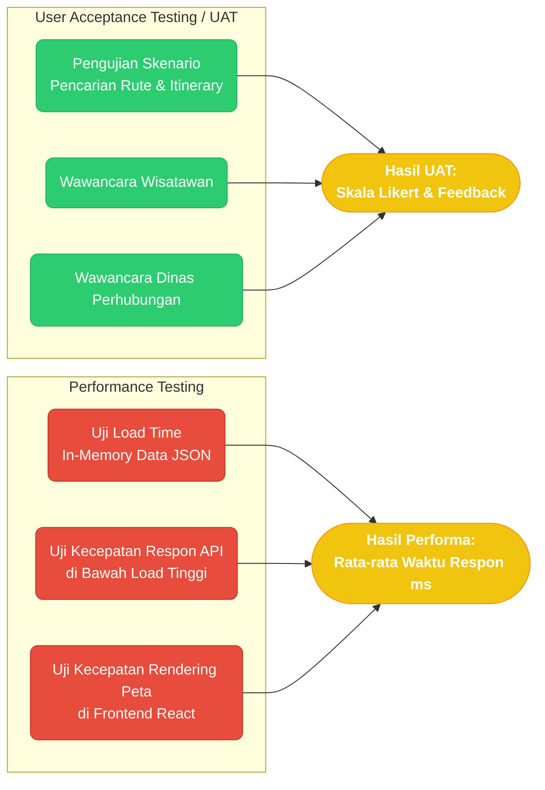

# Gambar 4.39 Diagram Rincian Pengujian Non-Fungsional (Performa dan UAT)

```mermaid
flowchart LR
    classDef uat fill:#2ecc71,stroke:#27ae60,color:#fff,rx:8px,ry:8px;
    classDef perf fill:#e74c3c,stroke:#c0392b,color:#fff,rx:8px,ry:8px;
    classDef result fill:#f1c40f,stroke:#f39c12,color:#fff,rx:8px,ry:8px,font-weight:bold;
    classDef group fill:none,stroke:#2c3e50,stroke-width:2px,stroke-dasharray: 5 5;

    subgraph UAT [User Acceptance Testing / UAT]
        U1(Pengujian Skenario\nPencarian Rute & Itinerary):::uat
        U2(Wawancara Wisatawan):::uat
        U3(Wawancara Dinas Perhubungan):::uat
    end

    subgraph PERF [Performance Testing]
        P1(Uji Load Time\nIn-Memory Data JSON):::perf
        P2(Uji Kecepatan Respon API\ndi Bawah Load Tinggi):::perf
        P3(Uji Kecepatan Rendering Peta\ndi Frontend React):::perf
    end
    
    R1([Hasil UAT:\nSkala Likert & Feedback]):::result
    R2([Hasil Performa:\nRata-rata Waktu Respon ms]):::result

    U1 --> R1
    U2 --> R1
    U3 --> R1

    P1 --> R2
    P2 --> R2
    P3 --> R2
```
