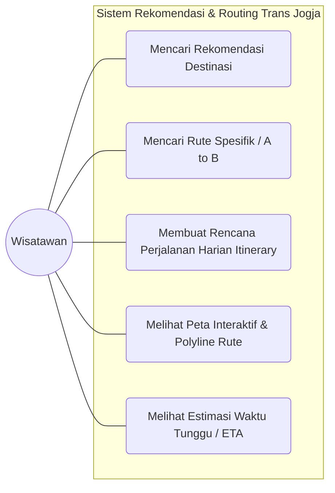

# Gambar 4.3 Diagram Kebutuhan Pengguna (User Requirement Diagram)

```mermaid
flowchart LR
    Actor((Wisatawan))
    
    subgraph Sistem Rekomendasi & Routing Trans Jogja
        UC1(Mencari Rekomendasi Destinasi)
        UC2(Mencari Rute Spesifik / A to B)
        UC3(Membuat Rencana Perjalanan Harian Itinerary)
        UC4(Melihat Peta Interaktif & Polyline Rute)
        UC5(Melihat Estimasi Waktu Tunggu / ETA)
    end
    
    Actor --- UC1
    Actor --- UC2
    Actor --- UC3
    Actor --- UC4
    Actor --- UC5
```
