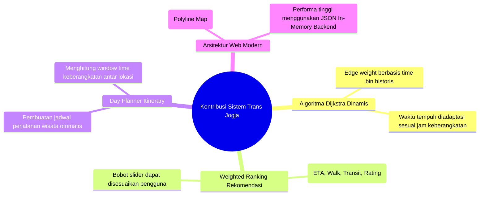

# Gambar 4.40 Diagram Ringkasan Kontribusi Penelitian

```mermaid
mindmap
  root((Kontribusi Sistem Trans Jogja))
    Algoritma Dijkstra Dinamis
      Edge weight berbasis time bin historis
      Waktu tempuh diadaptasi sesuai jam keberangkatan
    Weighted Ranking Rekomendasi
      Evaluasi Multi-kriteria (ETA, Walk, Transit, Rating)
      Bobot slider dapat disesuaikan pengguna
    Day Planner Itinerary
      Pembuatan jadwal perjalanan wisata otomatis
      Menghitung window time keberangkatan antar lokasi
    Arsitektur Web Modern
      Visualisasi jaringan transportasi riil (Polyline Map)
      Performa tinggi menggunakan JSON In-Memory Backend
```
