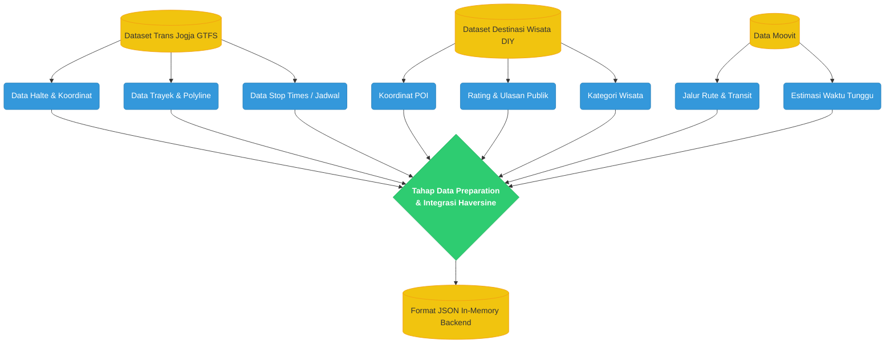

# Gambar 4.4 Diagram Sumber Data Penelitian

```mermaid
flowchart TD
    classDef dataset fill:#f1c40f,stroke:#f39c12,color:#333,rx:10px,ry:10px;
    classDef field fill:#3498db,stroke:#2980b9,color:#fff,rx:5px,ry:5px;
    classDef process fill:#2ecc71,stroke:#27ae60,color:#fff,rx:20px,ry:20px,font-weight:bold;

    A[(Dataset Trans Jogja GTFS)]:::dataset
    B[(Dataset Destinasi Wisata DIY)]:::dataset
    K[(Data Moovit)]:::dataset
    
    A --> C(Data Halte & Koordinat):::field
    A --> D(Data Trayek & Polyline):::field
    A --> E(Data Stop Times / Jadwal):::field
    
    B --> F(Koordinat POI):::field
    B --> G(Rating & Ulasan Publik):::field
    B --> H(Kategori Wisata):::field
    
    K --> L(Jalur Rute & Transit):::field
    K --> M(Estimasi Waktu Tunggu):::field
    
    C --> I{Tahap Data Preparation\n& Integrasi Haversine}:::process
    D --> I
    E --> I
    F --> I
    G --> I
    H --> I
    L --> I
    M --> I
    
    I --> J[(Format JSON In-Memory Backend)]:::dataset
```
