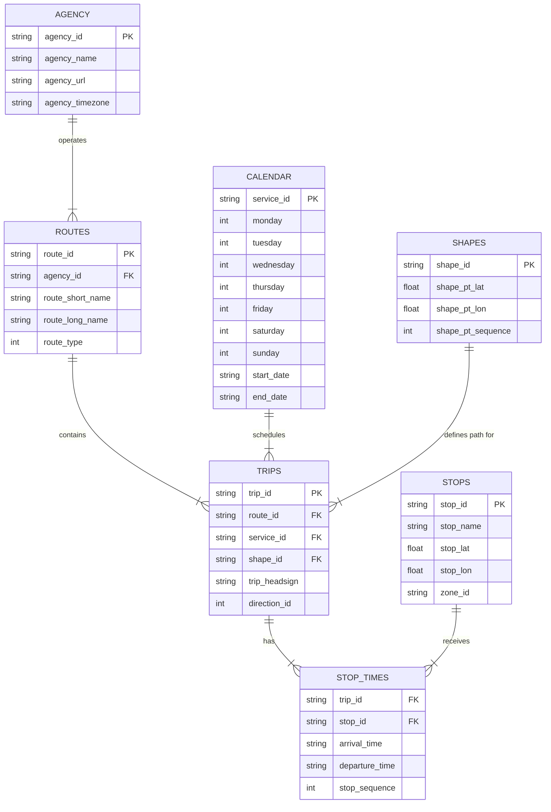

# Gambar 4.3 Diagram Relasi Dataset GTFS

```mermaid
erDiagram
    AGENCY {
        string agency_id PK
        string agency_name
        string agency_url
        string agency_timezone
    }
    
    ROUTES {
        string route_id PK
        string agency_id FK
        string route_short_name
        string route_long_name
        int route_type
    }
    
    TRIPS {
        string trip_id PK
        string route_id FK
        string service_id FK
        string shape_id FK
        string trip_headsign
        int direction_id
    }
    
    STOPS {
        string stop_id PK
        string stop_name
        float stop_lat
        float stop_lon
        string zone_id
    }
    
    STOP_TIMES {
        string trip_id FK
        string stop_id FK
        string arrival_time
        string departure_time
        int stop_sequence
    }
    
    CALENDAR {
        string service_id PK
        int monday
        int tuesday
        int wednesday
        int thursday
        int friday
        int saturday
        int sunday
        string start_date
        string end_date
    }
    
    SHAPES {
        string shape_id PK
        float shape_pt_lat
        float shape_pt_lon
        int shape_pt_sequence
    }

    AGENCY ||--|{ ROUTES : "operates"
    ROUTES ||--|{ TRIPS : "contains"
    TRIPS ||--|{ STOP_TIMES : "has"
    STOPS ||--|{ STOP_TIMES : "receives"
    CALENDAR ||--|{ TRIPS : "schedules"
    SHAPES ||--|{ TRIPS : "defines path for"
```
